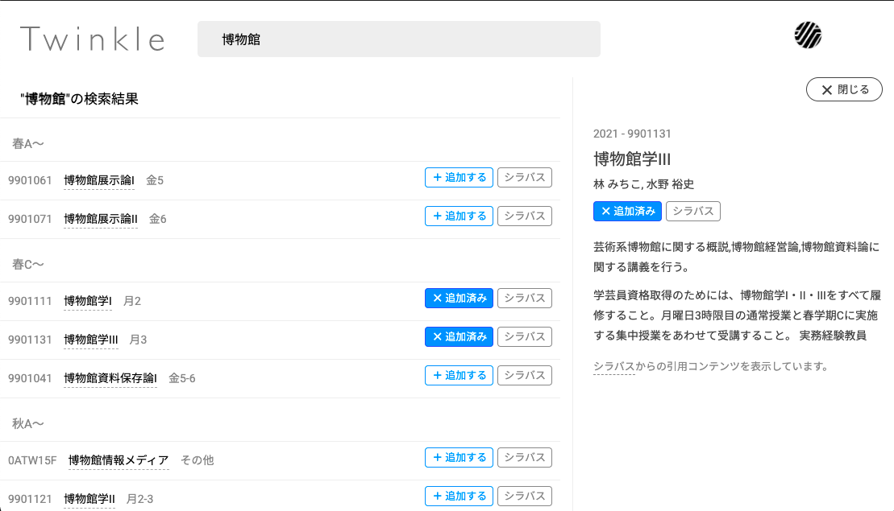

本日 4/6 のアップデートで、[新 UI "suzukake"](https://app.twinkle.nandenjin.com)はバージョン 0.6.1 になりました。

[[toc]]

## シラバスへのリンク機能を追加しました

コース一覧画面にシラバスへのリンクが表示されるようになりました。検索画面など一部では、授業概要などより細かな情報のプレビューも可能になり、Twinkleだけでも授業の仮組みが便利にできるようになりました。

同時に、コレクションへの追加・削除の操作ボタンも、よりわかりやすい位置に移動しました。ぜひお試しください。

## そのほかの改善

- 検索画面とコレクション画面の科目リストデザインを統一しました。
- 集中授業など、特殊スケジュールで開講される授業の表示をわかりやすく改善しました。
- 検索画面のローディングマークが不審な挙動をしていた不具合を改善しました。(Internal Issue `#155`)
- モバイル表示でクリックの可否がわかりにくかったデザインを修正しました。
- そのほか、外部パッケージの更新をおこないました。

---

ご意見・不具合のご報告をお待ちしています。アプリ内のフィードバック、[`docs`リポジトリのDiscussion](https://github.com/nandenjin/twinkle-docs/discussions)、EmailやTwitterでお寄せください。
