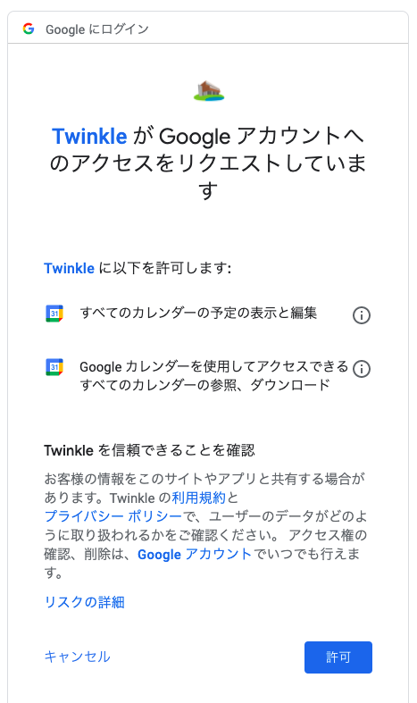

# ユーザー登録

Twinkleは、Googleアカウントを利用して登録できます。

## 登録手順

1. [Twinkleにアクセス](https://app.twinkle.nandenjin.com/login)し、「ログイン」をクリックします。
2. 個人のGoogleアカウントでログインします。
3. 以下のような **「TwinkleがGoogleアカウントへのアクセスをリクエストしています」** の画面が表示される場合は、「許可」をクリックします。

## ヒント

- 授業時間割を登録するカレンダーは、ここで選択したGoogleアカウントが持っているものから選択できます。
- TwinkleはバックグラウンドでGoogleカレンダーへアクセスし、自動で予定の書き込み・削除を行います。このため、ログイン時に「すべてのカレンダーのイベントの表示・編集」権限（`https://www.googleapis.com/auth/calendar.events`）をリクエストします。
  - あなたが操作したとき以外に、Twinkleがカレンダーへアクセスしたり書き換えたりすることはありません。
