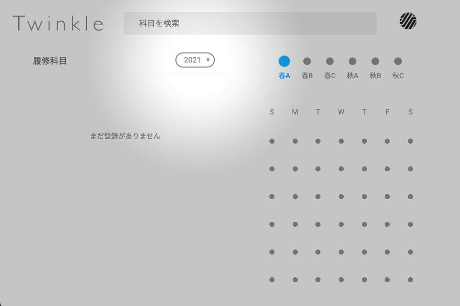

Twinkle は、本日 4 月 3 日時点で KdB に掲載されている 2021 年度開設科目に対応しました。

[[toc]]

## Beta 版 UI（`suzukake`）での利用方法

[Beta 版の WebUI](https://app.twinkle.nandenjin.com)では、操作画面で複数の年度を切り替えることができます。履修科目リスト横の年度表示が「2021」になるように切り替えてご使用ください。

## 従来の UI（`keyaki`）での利用方法

[従来の WebUI](https://twinkle.nandenjin.com)では、操作画面でひとつの年度のみが表示されます。現在はすべての方に 2021 年度の科目が表示されるよう切り替わっています。

画面下のメールアドレス横のバッジが「2021」になっていることを確認のうえ、そのままお使いください。

## うまくいかないときは

切り替えがうまくいかないとき・不具合を発見されたときは、お気軽にご相談ください。

- [Twitter](https://twitter.com/nandenjin)
