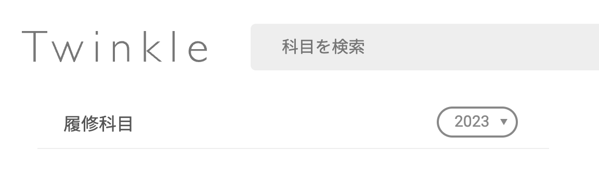

Twinkle は、本日 4 月 6 日時点で KdB に掲載されている 2023 年度開設科目に対応しました。

[[toc]]

## WebUIでの利用方法

[WebUI](https://app.twinkle.nandenjin.com)では、操作画面で複数の年度を切り替えることができます。履修科目リスト横の年度表示が「2023」になるように切り替えてご使用ください。

## うまくいかないときは

切り替えがうまくいかないとき・不具合を発見されたときは、お気軽にご相談ください。

- [Twitter](https://twitter.com/nandenjin)
